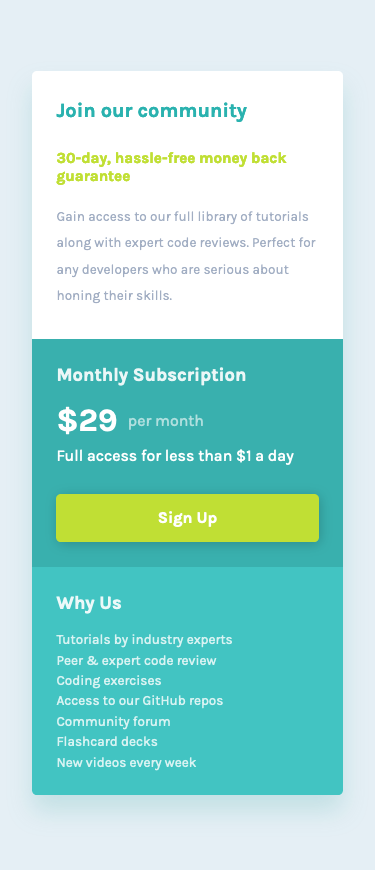
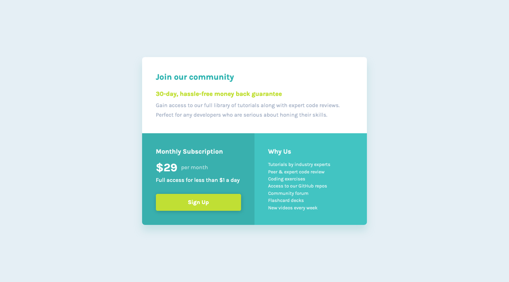

# Frontend Mentor - Single price grid component solution

This is a solution to the [Single price grid component challenge on Frontend Mentor](https://www.frontendmentor.io/challenges/single-price-grid-component-5ce41129d0ff452fec5abbbc). Frontend Mentor challenges help you improve your coding skills by building realistic projects.

## Table of contents

- [Overview](#overview)
  - [The challenge](#the-challenge)
  - [Screenshot](#screenshot)
  - [Links](#links)
- [My process](#my-process)
  - [Built with](#built-with)
  - [What I learned](#what-i-learned)
  - [Continued development](#continued-development)
  - [Useful resources](#useful-resources)
- [Author](#author)
- [Acknowledgments](#acknowledgments)

**Note: Delete this note and update the table of contents based on what sections you keep.**

## Overview

### The challenge

Users should be able to:

- View the optimal layout for the component depending on their device's screen size
- See a hover state on desktop for the Sign Up call-to-action

### Screenshot





### Links

- Solution URL: [Frontend Mentor Submission](https://www.frontendmentor.io/challenges/single-price-grid-component-5ce41129d0ff452fec5abbbc/hub)
- Live Site URL: [Hosted on Netlify](https://incomparable-lamington-b02e5b.netlify.app/)

## My process

This was my very first challenge, which I realised only after isn't the suggested starting challenge. Nevertheless, I picked something newbish that looked doable to me. I learnt lots along the way.

The process was shaped half by my learning curve and half by the fact I'm not on a pro account and had to work off of the design jpgs alone. I believe it would have been different were I using the figma files.

During the challenge I went on a few learning 'tangents' which steered the process along the way. The topics were mobile-first workflow, css units, css pre-compilers, pseudo-elements and absolute positioning.

I started without much of a plan, roughly emulating what I could see and hoping for the best. This wasn't an approach I liked, because I prefer working with precise detail, but it was the only method I could think of at that point. My process was also interrupted early on due to a long break from coding. (see gap after initial commits) When I picked up the project again, the rough layout was there and I was stuck on how to make it better. I realised I had glossed over parts of the style guide that I didn't understand, most importantly the design widths, where the wording confused me. ```The designs were created to the following widths:

- Mobile: 375px
- Desktop: 1440px``` I wasn't sure what this was referring to and how it translates to outputting a responsive layout. I had to look to posts on the community discord server for clues before realising these were not expected set widths but rather the image resolutions as the examples to work from. The task made a lot more sense then - my starting point was matching the devtools device view to the image/design widths so I could more accurately compare and copy. I found their respective heights on the jpgs and set the responsive view to these dimensions. I then began the painstaking process of matching things as best I could by eye. I found myself spending a lot of time layering the image file on top of my rendered code in the browser viewport to compare all the elements, spaces colours, border-radius etc. In the end I put in my best effort to closely copy the given designs by eye. It was never going to be an exact pixel-perfect replica, but I think it looks quite similar.

The website suggests using challenges as opportunities to try new tools, which encouraged me to let my learning change the course of my work a number of times. For starters, I also saw mention of css pre-compilers and was inspired to try out Sass, which I had heard about but never explored. Given that I wasn't planning to use React for this, there would be no issue deciding between that and styled components.

Other decisions came out of reading the community posts on Discord. Before this challenge, I had learnt about responsive websites as working on a website and then making tweaks for mobile friendliness. During the challenge my perspective changed. On the server, I found comments urging challengers to start by the mobile design. I researched this and learnt about mobile-first designs vs. desktop-first designs (See resources below for links to articles). I then understood the merit of working mobile-first for responsiveness and switched my approach. This meant undoing some work then resuming to the mobile design first. I think the extra steps were worth it.

On Discord, I also came acoss comments about problems arising from overuse of percentage and pixel units in styling, where em and rem units should be used. I recognised a clear gap in my knowledge as until then I had been using pixels and percentages for everything and didn't really understand what em and rem were. So I took some time to learn more before continuing the challenge. Understanding how these units work did change how I approached the task in that it got me thinking about how I want my element sizes to relate to one another at different breakpoints.

### Built with

- HTML5
- CSS including Flexbox
- [SCSS(Sass)](https://sass-lang.com/) - For styles
- Mobile-first workflow

### What I learned

I initially intended to structure the page using bootstrap grid, but decided to try structuring without relying on bootstrap. Since I don't know css grid yet, I used flexbox, which I do know. It did what I needed but I do wonder if a grid structure might have worked better. Also, I came into some trouble when it got to adding the attribution footer. Having centered the main container using flexbox, it occurred to me that adding a new element onto the same axis would throw everything off balance. I looked for solutions and found absolute poitioning, which until then I'd only heard of as a big no-no to avoid at all costs. In this situation though it proved very useful. I also ended up learning about the before and after pseudo elements, and using them with absolute positioning, and of course decided to include these in my challenge too. I did so for the hover state requirement.

```css
a {
  display: block;
  text-align: center;
  margin-block: 1.64rem 0.11rem;
  padding-block: 0.75em;
  border-radius: 0.3rem;
  background: config.$secondary-color;
  color: #ffff;
  box-shadow: 0.1em 0.1em 0.7em rgba(0, 0, 0, 0.2);
  font-weight: 700;
  position: relative;
  transition: all ease-in-out 150ms;
}

a::before {
  content: "";
  position: absolute;
  top: 0;
  right: 0;
  bottom: 0;
  left: 0;
  border-radius: 0.4em;
  border: 1px solid config.$secondary-color;
  opacity: 0;
  transition: all ease-in-out 250ms;
}

a::after {
  content: "";
  position: absolute;
  top: 0;
  right: 0;
  bottom: 0;
  left: 0;
  border-radius: 0.2em;
  box-shadow: -2px -2px 8px 1px color.scale(
      config.$primary-color,
      $lightness: -10%,
      $alpha: -15%
    ) inset;
  opacity: 0;
  transition: all ease-in-out 150ms;
}

a:hover {
  background: color.scale(config.$secondary-color, $alpha: -20%);
  transform: scale(1.03);
}

a:hover::before,
a:hover::after {
  opacity: 1;
}

a:hover::before {
  transform: scale(1.05, 1.25);
}
```

Following a mobile-first workflow meant switching from my previously learnt habits for media queries. In practice there wasn't much to it beyond switching from max-width to min-width for screen sizes, but it did take some getting used to, especially having to ensure I target the right places on my css file when making adjustments.

I learnt about the 'em' and 'rem' units, how it works in the browser and why it's used. I understood the benefit of switching from fixed units to relative units, including the potential to minimise complex media queries when they are used right. I ended up switching all px to ems and rems and feel I may have overdone it. I need to learn what is standard practice for when to use which. I think this will also come with experience.

One of my major learnings from this experience is to do more with the process rather than the code, and came after the fact almost, when I was just about finishing up and past the point of trying new ideas. This was the realisation that just because I don't have access to the design files, doesn't mean I can't use design tools myself to help with the challenge. Had it occured to me sooner, and I had a good grasp of figma, I might have saved a lot of time and agony by first studying the design images for clues. I measured pixels by employing the rectangle selector on my computer's built in image viewer and this was not easy or efficient. I had to be content with ballopark estimates. Next time if I have to do without a design file I will first put in some time to reverse engineer that design, creating my best version of a design file to have for reference throughout building.
For this reason another thing I'd like to learn is figma or another design tool that can deconstruct an image.

Use this section to recap over some of your major learnings while working through this project. Writing these out and providing code samples of areas you want to highlight is a great way to reinforce your own knowledge.

To see how you can add code snippets, see below:

```html
<h1>Some HTML code I'm proud of</h1>
```

```css
.proud-of-this-css {
  color: papayawhip;
}
```

If you want more help with writing markdown, we'd recommend checking out [The Markdown Guide](https://www.markdownguide.org/) to learn more.

**Note: Delete this note and the content within this section and replace with your own learnings.**

### Continued development

I'd never heard of markdown until this readme and this will be on my list of things to look at.

I'd like an oportunity to learn the mobile-first approach in more depth, maybe explore touch functionality as a consideration, and how it fits within styling and javascript events.

Get more familiar with figma tools so that I can use it to reverse engineer designs when I only have an image.

More experience using different css units.

Find a way to take screenshots on Chrome or adjust the output on Firefox

Use this section to outline areas that you want to continue focusing on in future projects. These could be concepts you're still not completely comfortable with or techniques you found useful that you want to refine and perfect.

**Note: Delete this note and the content within this section and replace with your own plans for continued development.**

### Useful resources

- [Web Development: Mobile First or Desktop First?](https://www.softermii.com/blog/web-development-mobile-first-or-desktop-first) - Although used to advertise a service, I found this page quite helpful in explaining mobile-first vs desktop-first websites when I had never heard of these terms before.

- [How to "make a site responsive" and use Media Queries well](https://fedmentor.dev/posts/responsive-meaning/) - This article furthered my understanding of responsive websites. The outlined best practices for media queries served as a refresher and the exploration of responsiveness as a concept got me thinking about the overall attitude needed for building better responsive layouts. Part of this ties in mobile-first workflow and helped me see the benefit.

Additionally, it helped me make more sense of this challenge specifically and the instructions that confused me. It refers to the design resolutions in Frontend Mentor challenges and describes some steps in working with the images - comparing and matching to the mobile dimensions then moving on to others. This clarified the purpose of the provided design width as a starting point for matching the development viewport dimensions to those of the design images.

- [Example resource 1](https://www.example.com) - This helped me for XYZ reason. I really liked this pattern and will use it going forward.
- [Example resource 1](https://www.example.com) - This helped me for XYZ reason. I really liked this pattern and will use it going forward.
- [Example resource 2](https://www.example.com) - This is an amazing article which helped me finally understand XYZ. I'd recommend it to anyone still learning this concept.

**Note: Delete this note and replace the list above with resources that helped you during the challenge. These could come in handy for anyone viewing your solution or for yourself when you look back on this project in the future.**

## Author

- Website - [Add your name here](https://www.your-site.com)
- Frontend Mentor - [@yourusername](https://www.frontendmentor.io/profile/yourusername)
- Twitter - [@yourusername](https://www.twitter.com/yourusername)

**Note: Delete this note and add/remove/edit lines above based on what links you'd like to share.**
